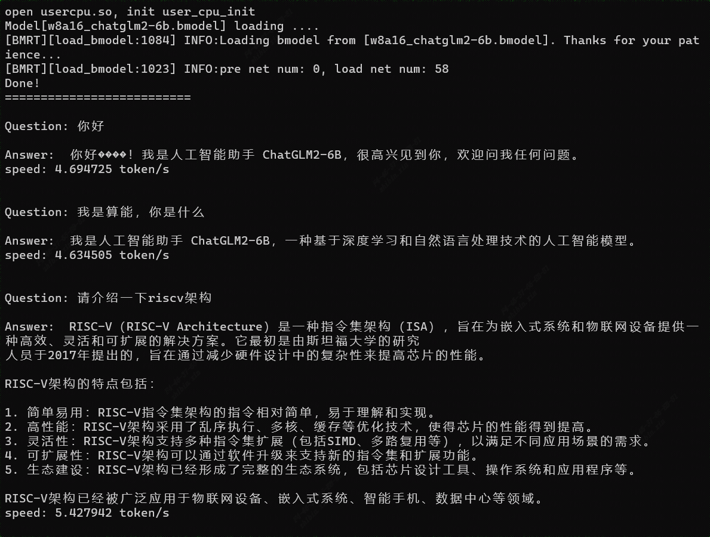

# ChatGLM2-TPU

本项目实现BM1684X部署语言大模型[ChatGLM2-6B](https://huggingface.co/THUDM/chatglm2-6b)。通过[TPU-MLIR](https://github.com/sophgo/tpu-mlir)编译器将模型转换成bmodel，并采用c++代码将其部署到BM1684X的PCIE环境，或者SoC环境。

下文中默认是PCIE环境；如果是SoC环境，按提示操作即可。

在知乎上写了关于`ChatGLM2-6B`的解读，方便大家理解源码：

[ChatGLM2-6B流程解析与TPU-MLIR部署](https://zhuanlan.zhihu.com/p/641975976)


## 开发环境


1. 下载docker，启动容器，如下：

``` shell
docker pull sophgo/tpuc_dev:latest

# myname1234 is just an example, you can set your own name
docker run --privileged --name myname1234 -v $PWD:/workspace -it sophgo/tpuc_dev:latest
```
后文假定环境都在docker的`/workspace`目录。

如果是要在SoC环境运行，则需要安装如下库：

``` shell
apt-get install gcc-aarch64-linux-gnu g++-aarch64-linux-gnu
```

2. 下载`ChatGLM2-6B`，比较大，会花较长时间

``` shell
git lfs install
git clone git@hf.co:THUDM/chatglm2-6b
```
并对该工程做两点修改，
一是将`config.json`文件中`seq_length`配置为512；
二是将`modeling_chatglm.py`文件中的如下代码：

```python
if attention_mask is not None:
    attention_scores = attention_scores.masked_fill(attention_mask, float("-inf"))
```

修改为：

```python
if attention_mask is not None:
    attention_scores = attention_scores + (attention_mask * -10000.0)
```

这样修改可以提升效率，使用`masked_fill`效率低下；另一方面`masked_fill`转ONNX存在些bug。

3. 下载`TPU-MLIR`代码并编译，(也可以直接下载编译好的release包解压)

``` shell
git clone git@github.com:sophgo/tpu-mlir.git
cd tpu-mlir
source ./envsetup.sh
./build.sh
```

4. 下载[sentencepiece](https://github.com/google/sentencepiece)，并编译得到`sentencepiece.a`

```shell
git clone git@github.com:google/sentencepiece.git
cd sentencepiece
mkdir build
cd build
cmake ..
make -j
```

如果要编译SoC环境，则需要在`CMakeLists.txt`加入如下代码：

```cmake
set(CMAKE_C_COMPILER aarch64-linux-gnu-gcc)
set(CMAKE_ASM_COMPILER aarch64-linux-gnu-gcc)
set(CMAKE_CXX_COMPILER aarch64-linux-gnu-g++)
```

5. 下载libsophon库并安装

在算能官网<https://developer.sophgo.com/site/index/material/all/all.html>可以找到SDK最新版本，如下：

```shell
wget https://sophon-file.sophon.cn/sophon-prod-s3/drive/23/06/15/16/Release_230501-public.zip
```
解压sdk后安装libsophon，如下：

```shell
apt install sophon-libsophon-dev_0.4.8_amd64.deb
```

注意如果是SoC环境则安装arm64版本`sophon-libsophon-dev_0.4.8_arm64.deb`

6. 下载本项目`ChatGLM2-TPU`，如下：

``` shell
git clone git@github.com:sophgo/ChatGLM2-TPU.git
```

## 编译模型

1. 指定`ChatGLM2-6B`的python路径

``` shell
export PYTHONPATH=/workspace/chatglm2-6b:$PYTHONPATH
```

2. 导出所有onnx模型，如果过程中提示缺少某些组件，直接`pip install 组件`即可

``` shell
cd chatglm2-tpu/compile
python3 export_onnx.py
```
此时有大量onnx模型被导出到tmp目录

3. 对onnx模型进行编译，生成bmodel，这个过程会花一些时间，最终生成`chatglm2-6b.bmodel`文件

```shell
./compile.sh
```

## 编译程序

```shell
cd chatglm2-tpu/demo
mkdir build
cd build
cmake ..
make -j
```

如果是SoC环境，则将CMakeLists.txt中加入，并将SoC版本的`libsentencepiece.a`替换过来：

```cmake
set(CMAKE_C_COMPILER aarch64-linux-gnu-gcc)
set(CMAKE_ASM_COMPILER aarch64-linux-gnu-gcc)
set(CMAKE_CXX_COMPILER aarch64-linux-gnu-g++)
```

编译生成chatglm2可执行程序，将`chatglm2`、`chatglm2-6b.bmodel`和`tokenizer.model`拷贝到运行环境就可以执行了。
(`tokenizer.model`来自`ChatGLM2-6B`)


## 运行效果



